# Screenshot MCP Tool

A modular, robust MCP tool for capturing, processing, and describing screenshots with a clean three-layer architecture.

## What is the Screenshot Tool?

The Screenshot Tool solves the common problem of capturing and analyzing screen content within AI workflows. It provides:

1. **High-performance screen capture** using MSS instead of PyAutoGUI for better reliability
2. **Advanced image processing** with proper resizing and compression
3. **AI-powered image description** using Gemini Pro/Vertex AI
4. **MCP integration** for seamless use with Claude and other AI agents

## Three-Layer Architecture

This tool implements the three-layer architecture for maximum maintainability, testability, and extensibility:

```mermaid
flowchart TD
    %% Phase labels
    PhaseA[Core Layer]:::phaseLabel
    PhaseB[CLI Layer]:::phaseLabel
    PhaseC[MCP Layer]:::phaseLabel
    
    %% Core Layer
    PhaseA -.-> A1[🖼️ Image Capture]
    PhaseA -.-> A2[🔍 Image Processing]
    PhaseA -.-> A3[📋 Image Description]
    PhaseA -.-> A4[⚙️ Constants/Config]
    PhaseA -.-> A5[🔧 Utilities]
    PhaseA -.-> A6[📷 MSS Wrapper]
    
    %% CLI Layer
    PhaseB -.-> B1[📱 CLI Interface]
    PhaseB -.-> B2[📊 Rich Formatting]
    PhaseB -.-> B3[🛠️ Validation/Error Handling]
    
    %% MCP Layer
    PhaseC -.-> C1[🔌 MCP Functions]
    PhaseC -.-> C2[🔄 Parameter Mapping]
    PhaseC -.-> C3[🖥️ Server Entry Point]
    PhaseC -.-> C4[🔄 MCP Wrappers]
    
    %% Connections between layers
    A1 & A2 & A3 & A4 & A5 & A6 --> B1
    A1 & A2 & A3 & A4 & A5 & A6 --> C1 & C4
    B1 & B2 & B3 --> C3
    C1 & C2 & C4 --> C3
    
    %% Styling
    classDef phaseLabel fill:none,stroke:none,color:#6b21a8,font-weight:bold,font-size:16px;
    classDef core fill:#93c5fd,stroke:#1e40af,stroke-width:1px,color:#000;
    classDef cli fill:#d8b4fe,stroke:#6b21a8,stroke-width:1px,color:#000;
    classDef mcp fill:#86efac,stroke:#166534,stroke-width:1px,color:#000;
    
    class A1,A2,A3,A4,A5,A6 core;
    class B1,B2,B3 cli;
    class C1,C2,C3,C4 mcp;
```



### 1. Core Layer

The Core Layer contains the pure business logic without dependencies on UI or MCP:

- `core/capture.py` - Core screenshot capture functionality using MSS
- `core/image_processing.py` - Image resizing and compression utilities
- `core/description.py` - AI-powered image description using LiteLLM
- `core/constants.py` - Configuration settings and constants
- `core/mss.py` - Low-level MSS wrapper functions
- `core/utils.py` - Utility functions for validation and error handling

This layer:
- Has minimal external dependencies
- Is independently testable with clear I/O
- Implements self-validation through unit tests
- Contains function-level documentation with samples

### 2. CLI Layer

The CLI Layer provides the command-line interface for human users:

- `cli/cli.py` - Typer-based CLI with rich formatting for human users
- `cli/formatters.py` - Rich-formatted tables and panels for results display
- `cli/validators.py` - Command validation and parameter processing
- `cli/schemas.py` - Schema definitions and validation

This layer:
- Handles user interaction concerns
- Formats outputs for human readability
- Manages command-line argument parsing
- Implements CLI-specific error handling

### 3. MCP Layer

The MCP Layer connects the core functionality to the Model Context Protocol for AI agents:

- `mcp/mcp_tools.py` - FastMCP function definitions for screenshot tools
- `mcp/mcp_server.py` - Server entry point for MCP integration
- `mcp/wrappers.py` - Clean parameter mapping between MCP and core functions

This layer:
- Exposes core functions as MCP tools
- Handles MCP-specific protocol requirements
- Manages server startup and configuration
- Implements MCP-compatible error responses

## Usage

### Core Layer API

```python
from mcp_tools.screenshot.core import capture_screenshot, describe_image_content

# Capture screenshot
result = capture_screenshot(quality=70, region="right_half")
screenshot_path = result["file"]

# Get image description
description = describe_image_content(
    image_path=screenshot_path,
    prompt="Describe what you see in this image"
)
print(description["description"])
```

### CLI Commands

```bash
# Take a screenshot
python -m mcp_tools.screenshot.cli.cli screenshot --quality 70 --region right_half

# Take a screenshot and get AI description
python -m mcp_tools.screenshot.cli.cli describe --region full --prompt "What's in this image?"

# Show available screen regions
python -m mcp_tools.screenshot.cli.cli tools regions

# Get description for existing image
python -m mcp_tools.screenshot.cli.cli vision describe path/to/image.jpg

# Output results as JSON (works with all commands)
python -m mcp_tools.screenshot.cli.cli screenshot --json

# Start the MCP server (redirects to MCP module)
python -m mcp_tools.screenshot.cli.cli tools serve
```

### MCP Server

```bash
# Start the MCP server
python -m mcp_tools.screenshot.mcp.mcp_server start

# Start with custom settings
python -m mcp_tools.screenshot.mcp.mcp_server start --host 0.0.0.0 --port 5000 --debug

# Run health check
python -m mcp_tools.screenshot.mcp.mcp_server health

# Display server information
python -m mcp_tools.screenshot.mcp.mcp_server info

# Display API schema
python -m mcp_tools.screenshot.mcp.mcp_server schema
```

## MCP Integration

### Setup

1. Ensure the screenshot tool is included in your `.mcp.json` configuration:

```json
{
  "mcpServers": {
    "screenshot": {
      "command": "python",
      "args": [
        "-m",
        "mcp_tools.screenshot.mcp.mcp_server",
        "start"
      ]
    }
  }
}
```

2. Start the screenshot MCP server:

```bash
python -m mcp_tools.screenshot.mcp.mcp_server start
```

### MCP Function Reference

#### screenshot

Takes a screenshot with options for region, quality, etc.

Parameters:
- `quality` (int): JPEG compression quality (1-100), default: 30
- `region` (str|list): Screen region to capture (e.g., "right_half" or coordinates [x, y, width, height])
- `include_description` (bool): Whether to include AI description, default: False
- `prompt` (str): Text prompt for description, default: "Describe this screenshot in detail."
- `model` (str): AI model for description, default: "vertex_ai/gemini-2.5-pro-preview-05-06"

#### describe_screenshot

Takes a screenshot and generates an AI description.

Parameters:
- `quality` (int): JPEG compression quality (1-100), default: 30
- `region` (str|list): Screen region to capture (e.g., "right_half" or coordinates [x, y, width, height])
- `prompt` (str): Text prompt for description, default: "Describe this screenshot in detail."
- `model` (str): AI model for description, default: "vertex_ai/gemini-2.5-pro-preview-05-06"

#### get_screen_regions

Returns information about available screen regions.

Parameters: None

#### describe_image

Provides an AI description of an existing image file.

Parameters:
- `image_path` (str): Path to the image file to describe
- `prompt` (str): Text prompt for the AI model, default: "Describe this image in detail."
- `model` (str): AI model for description, default: "vertex_ai/gemini-2.5-pro-preview-05-06"

## Debugging

### Using MCP Inspector

The MCP Inspector is essential for debugging the Screenshot Tool's MCP integration:

1. **Install MCP Inspector**:
```bash
git clone https://github.com/modelcontextprotocol/inspector.git
cd inspector
npm install
```

2. **Start the Screenshot MCP server** in debug mode:
```bash
python -m mcp_tools.screenshot.mcp.mcp_server start --debug
```

3. **Launch the MCP Inspector**:
```bash
cd /path/to/inspector
npm start
```

4. **Connect to the server** at http://localhost:3000 (default port)

5. **Test the functions** with different parameters:
   - Try the `screenshot` function with different regions
   - Test the `describe_screenshot` function with various prompts

## Project Structure

```
screenshot/
├── __init__.py              # Main package exports
├── README.md                # Documentation
├── CLAUDE.md                # Three-layer architecture documentation
├── core/                    # Core Layer - Business Logic
│   ├── __init__.py          # Core exports
│   ├── capture.py           # Screenshot capture
│   ├── constants.py         # Configuration
│   ├── description.py       # AI image description
│   ├── image_processing.py  # Image manipulation
│   ├── mss.py               # MSS wrapper
│   └── utils.py             # Utilities
├── cli/                     # CLI Layer - Command Line Interface
│   ├── __init__.py          # CLI exports
│   ├── cli.py               # CLI interface
│   ├── formatters.py        # Rich formatting
│   ├── schemas.py           # Schema definitions
│   └── validators.py        # Parameter validation
├── mcp/                     # MCP Layer - Model Context Protocol
│   ├── __init__.py          # MCP exports
│   ├── mcp_tools.py         # MCP function definitions
│   ├── mcp_server.py        # Server entry point
│   └── wrappers.py          # MCP wrappers
└── tests/                   # Tests for all layers
    ├── __init__.py
    ├── run_tests.py
    ├── test_core_utils.py
    ├── test_cli_formatters.py
    └── test_mcp_wrappers.py
```

## Requirements

- Python 3.7+
- MSS (screen capture library)
- Pillow (image processing)
- Typer (CLI interface)
- Rich (terminal formatting)
- LiteLLM (multimodal API access)
- FastMCP (MCP integration)

## Development

When extending this module, maintain the three-layer separation:

1. **Core Layer Changes**: Add pure function logic independent of interfaces
2. **CLI Layer Changes**: Update CLI without modifying core logic
3. **MCP Layer Changes**: Modify MCP integration without affecting the other layers

Always run the self-validation tests before committing changes:

```bash
# Test core modules
python -m mcp_tools.screenshot.core.capture
python -m mcp_tools.screenshot.core.image_processing
python -m mcp_tools.screenshot.core.description
python -m mcp_tools.screenshot.core.utils
python -m mcp_tools.screenshot.core.mss

# Test CLI formatters
python -m mcp_tools.screenshot.cli.formatters

# Test MCP wrappers
python -m mcp_tools.screenshot.mcp.wrappers
```
